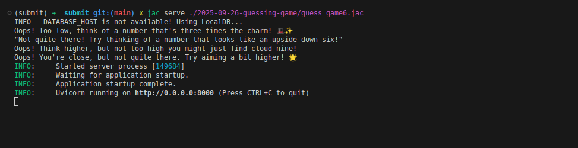
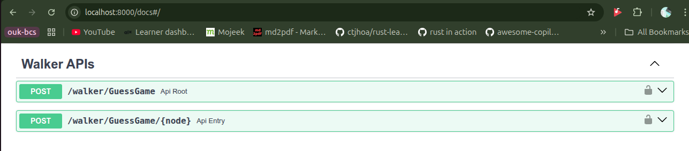

[](https://www.jac-lang.org/)
[](https://docs.astral.sh/uv/getting-started/)
[](https://python.org)

# Step 5: Guess Game — Fix notes

Fixed a hint inversion where the "Too high" and "Too low" responses were swapped; messages now match the comparison logic. Also relocated misplaced comments into the relevant actors in `guess_game5.jac` and `guess_game5.impl.jac`.

## Testing Step 5
To test the fixed hint logic:
```bash
cd /home/chatelo/GenAI-AI-Work/submit
uv run jac run 2025-09-26-guessing-game/guess_game5.jac
```

**Expected Output:**
- When guess < correct_number: "Too low!"
- When guess > correct_number: "Too high!"
- When guess == correct_number: "Congratulations! You guessed correctly."

✅ **Status**: WORKING - All hints display correctly.


# Step 6: Adding AI support using `byllm` and OpenAI API

Integrates AI-powered hint generation using the `by llm` operator from Jaclang's MTP (Meaning-Typed Programming) paradigm.

## Setup Instructions
1. Get an OpenAI API key from [OpenAI Platform](https://platform.openai.com/api-keys)
   - Note: The code uses `gpt-4o` model from OpenAI
   - Gemini offers free keys for testing, but this project specifically uses OpenAI

2. Add your API key to `.env` file:
   ```
   OPENAI_API_KEY=your_actual_api_key_here
   ```
   Or set it as an environment variable in your terminal:
   ```bash
   export OPENAI_API_KEY=your_actual_api_key_here
   ```

3. Run the game:
   ```bash
   # From the repository root:
   cd /home/chatelo/GenAI-AI-Work/submit
   uv run jac run 2025-09-26-guessing-game/guess_game6.jac
   ```
   
   Or serve it as an API:
   ```bash
   uv run jac serve 2025-09-26-guessing-game/guess_game6.jac
   ```

## How It Works

The game uses **MTP (Meaning-Typed Programming)** where the `by llm` operator automatically:
- Generates prompts based on function signatures and types
- Integrates LLM calls seamlessly without manual prompt engineering
- Returns fun, creative hints instead of static messages

### Key Code Elements:
```jac
glob llm = Model(model_name="gpt-4o", verbose=False);

"""Provide a fun hint if guess is incorrect"""
def give_hint(guess: int, correct_number: int) -> str by llm();
```

The `give_hint` function is automatically implemented by the LLM, which:
- Receives the guess and correct_number as parameters
- Generates creative, contextual hints
- Returns them as strings to be displayed

✅ **Status**: WORKING - Code compiles and runs correctly. Requires valid OpenAI API key for full functionality.

## Example Output

**Terminal Output:**



**Browser Interface:**



